#  LaptopShopAZ - Spring Boot E-Commerce Platform

<p align="center">
  
  
  
  
  
  
</p>

---

###  Project Overview 

A robust, full-stack E-Commerce web application dedicated to laptop retail, meticulously crafted using the **Spring Boot MVC** architecture, **JSP**, and **MySQL**. This production-ready platform bridges traditional e-commerce with modern DevOps practices and AI-driven experiences.

###  Key Features

* **Core Architecture:** Built on **Spring Boot 3.x** & **Java 21** utilizing the Model-View-Controller (MVC) pattern with **JSP** views.
* **Smart Assistant:** Integrated **AI Chatbot (RAG)** to provide intelligent product recommendations and support.
* **Secure Transactions:** Advanced authentication mechanisms combined with integrated **Online Payment** gateways.
* **DevOps & Automation:** Fully containerized with **Docker** and backed by continuous integration/deployment (**CI/CD**) pipelines.
* **Quality Assurance:** High code reliability ensured via comprehensive **JUnit 5** unit testing.

#  Table of Contents

- [Overview](#-overview)
- [Key Features](#-key-features)
- [Technology Stack](#-technology-stack)
- [System Architecture](#-system-architecture)

---


#  Overview

LaptopShopAZ is a full-stack e-commerce platform specializing in laptop sales, developed using the Spring Boot MVC framework with JSP technology.

Originally created as a university course project, the application has been continuously enhanced into a production-oriented portfolio project by integrating enterprise-level features such as AI-powered product recommendations, secure payment processing, Docker containerization, automated CI/CD pipelines, concurrency control, and comprehensive unit testing.

The project follows a layered architecture and applies software engineering best practices to ensure maintainability, scalability, and reliability.

Core business modules include:

- User Authentication
- Product Management
- Shopping Cart
- Order Management
- Payment Integration
- AI Product Consultant
- Email Notification
- Sales Statistics
- Docker Deployment
- Continuous Integration & Continuous Deployment

---

#  Key Features

##  Authentication & Authorization

- User Registration
- User Login / Logout
- Spring Security Authentication
- Session-based Authentication
- Google OAuth2 Login
- Forgot Password via Email
- BCrypt Password Encryption
- Role-based Authorization

---

##  Customer Features

- Browse Products
- Product Detail
- Multi-condition Product Filtering
- Product Search
- Shopping Cart
- Checkout
- Purchase History
- Cancel Orders
- Email Notifications
- AI Shopping Assistant

---

##  Administrator Features

### User Management

- Create User
- Update User
- Delete User
- User Detail
- Avatar Upload

### Product Management

- CRUD Products
- Category Management
- Product Images
- Inventory Management

### Order Management

- View Orders
- Update Order Status
- Cancel Orders
- Delete Orders
- Payment Monitoring

### Dashboard

- Monthly Revenue Statistics
- Order Status Distribution
- Top 5 Best-selling Products

---

##  Online Payment

Supported payment gateways:

- VNPay
- MoMo

Payment processing includes:

- Signature Verification
- Invoice Validation
- Idempotency Check
- Amount Verification
- Automatic Inventory Update

---

##  AI Shopping Assistant

Powered by:

- Google Gemini API
- Elasticsearch
- Retrieval-Augmented Generation (RAG)

Capabilities:

- Product Recommendation
- Context-aware Conversation
- Conversation History
- Full-text Search
- Fuzzy Matching
- Top 5 Relevant Product Retrieval

---

##  Cloud Storage

Cloudinary Integration

Features:

- Image Upload
- File Validation
- File Size Validation
- Automatic Cleanup via Cron Job

---

##  Security

- Spring Security
- BCrypt
- Environment Variables
- Global Exception Handling
- Session Authentication
- Hybrid Locking Strategy
- Input Validation

---

##  DevOps

- Docker
- Docker Compose
- GitHub Actions
- Docker Hub
- Ubuntu VPS Deployment
- Tailscale Secure Access

---

##  Testing

- 140 Unit Tests
- JUnit 5
- Mockito
- Arrange – Act – Assert Pattern

---

#  Technology Stack

| Category | Technologies |
|----------|--------------|
| Language | Java 21 |
| Backend | Spring Boot, Spring MVC |
| Security | Spring Security, OAuth2 |
| ORM | Spring Data JPA, Hibernate |
| Database | MySQL |
| Search Engine | Elasticsearch |
| AI | Google Gemini API |
| Frontend | JSP, JSTL, Bootstrap, HTML5, CSS3, JavaScript, jQuery, Ajax |
| Object Mapping | ModelMapper |
| Payment | VNPay, MoMo |
| Email | Spring Mail |
| Cloud Storage | Cloudinary |
| Build Tool | Maven |
| Testing | JUnit 5, Mockito |
| DevOps | Docker, Docker Compose |
| CI/CD | GitHub Actions |
| Deployment | Ubuntu VPS + Docker |

---

#  System Architecture

<!-- ========================================================= -->
<!-- TODO                                                      -->
<!--                                                           -->
<!-- Insert Architecture Diagram                              -->
<!--                                                           -->
<!-- File: docs/architecture.png                              -->
<!--                                                           -->
<!-- Recommended tool:                                         -->
<!-- draw.io                                                   -->
<!--                                                           -->
<!-- Include:                                                  -->
<!--                                                           -->
<!-- Browser                                                   -->
<!-- Spring Boot MVC                                           -->
<!-- Controller                                                -->
<!-- Service                                                   -->
<!-- Repository                                                -->
<!-- MySQL                                                     -->
<!-- Elasticsearch                                              -->
<!-- Gemini API                                                -->
<!-- Cloudinary                                                -->
<!-- VNPay                                                     -->
<!-- MoMo                                                      -->
<!-- ========================================================= -->

<p align="center">
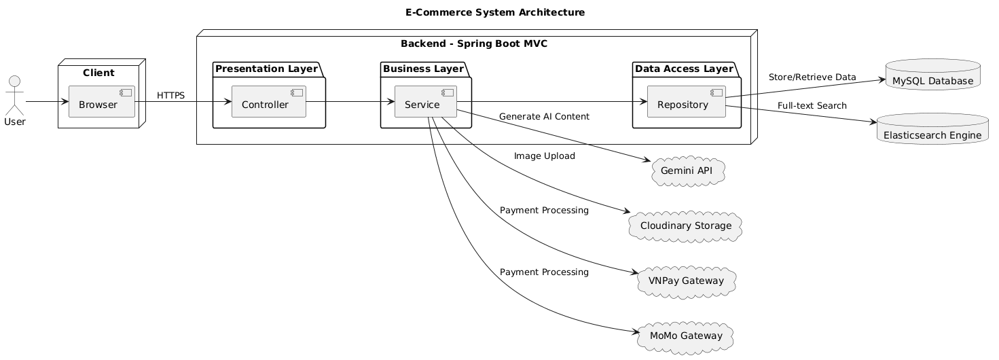
</p>

The application follows a layered architecture based on the Spring MVC pattern.

Each layer has a clear responsibility:

- **Presentation Layer** handles user interactions through JSP pages.
- **Controller Layer** processes HTTP requests and delegates business logic.
- **Service Layer** contains business rules and application logic.
- **Repository Layer** communicates with the database using Spring Data JPA.
- **Database Layer** stores application data in MySQL.

External services including Elasticsearch, Gemini API, Cloudinary, VNPay, and MoMo are integrated independently to improve scalability and maintainability.

---
# 📸 Screenshots


##  Home Page

<!-- ========================================================= -->
<!-- TODO: Replace with your Home Page screenshot              -->
<!-- File: docs/screenshots/home.png                           -->
<!-- Recommended size: 1600x900                                -->
<!-- ========================================================= -->

<p align="center">
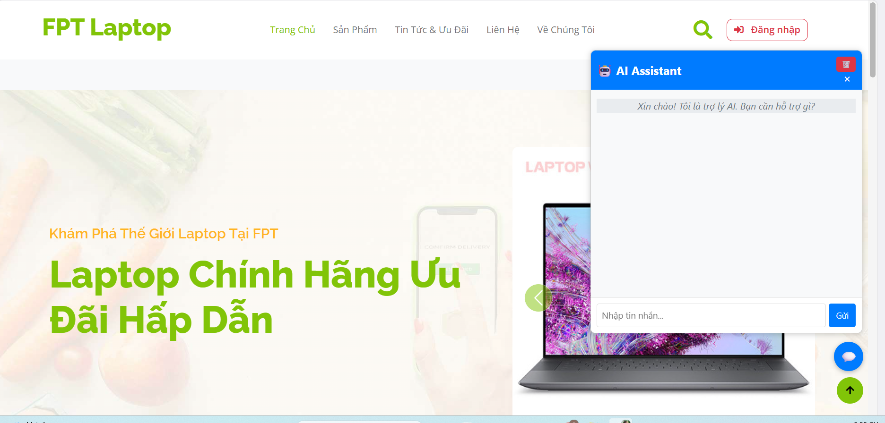
</p>

---

##  Product Listing

<!-- TODO -->
<!-- File: docs/screenshots/product-list.png -->

<p align="center">
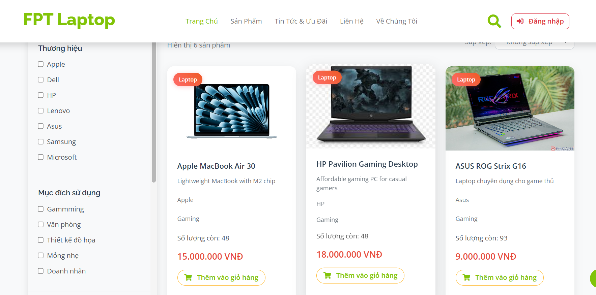
</p>

---

##  Product Detail

<!-- TODO -->
<!-- File: docs/screenshots/product-detail.png -->

<p align="center">
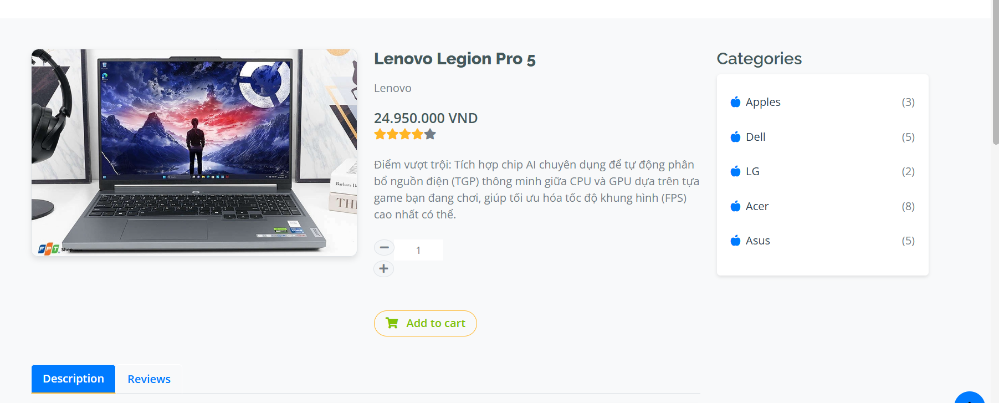
</p>

---

##  Shopping Cart

<!-- TODO -->
<!-- File: docs/screenshots/cart.png -->

<p align="center">
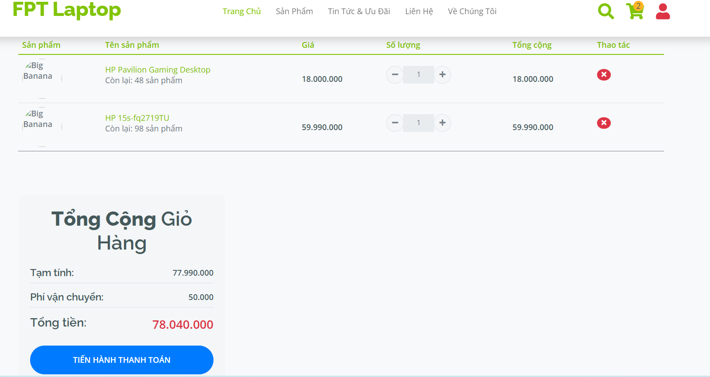
</p>

---

##  Checkout

<!-- TODO -->
<!-- File: docs/screenshots/checkout.png -->

<p align="center">
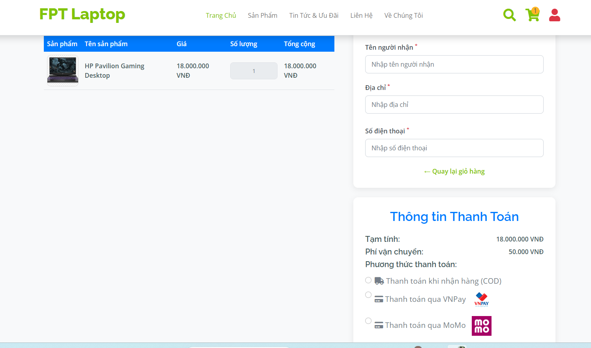
</p>

---

##  AI Shopping Assistant

<!-- TODO -->
<!-- File: docs/screenshots/chatbot.png -->

<p align="center">
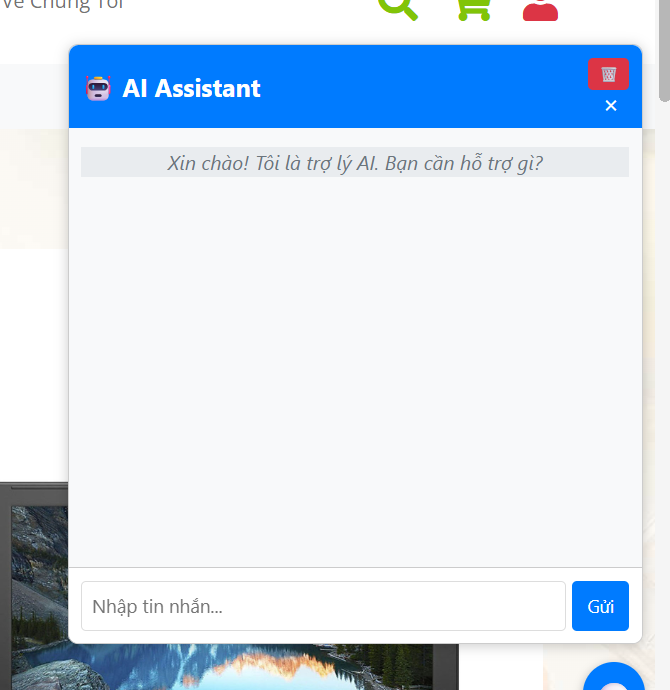
</p>

---

##  Purchase History

<!-- TODO -->
<!-- File: docs/screenshots/history.png -->

<p align="center">
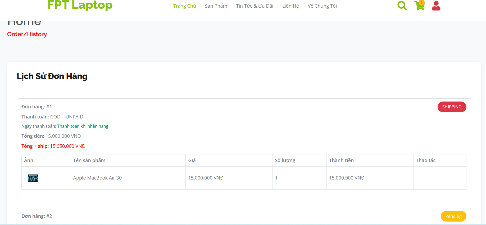
</p>

---

##  Admin Dashboard

<!-- TODO -->
<!-- File: docs/screenshots/dashboard.png -->

<p align="center">
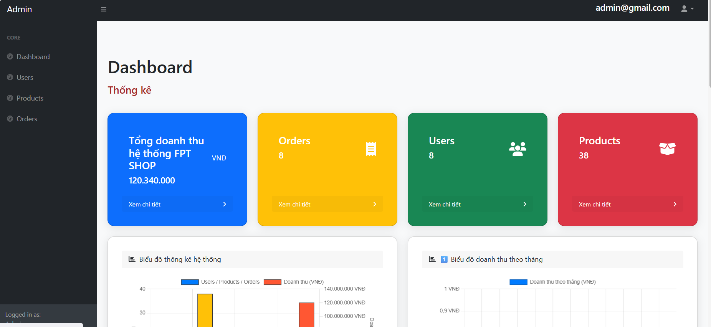
</p>

---

##  Revenue Statistics

<!-- TODO -->
<!-- File: docs/screenshots/statistics.png -->

<p align="center">
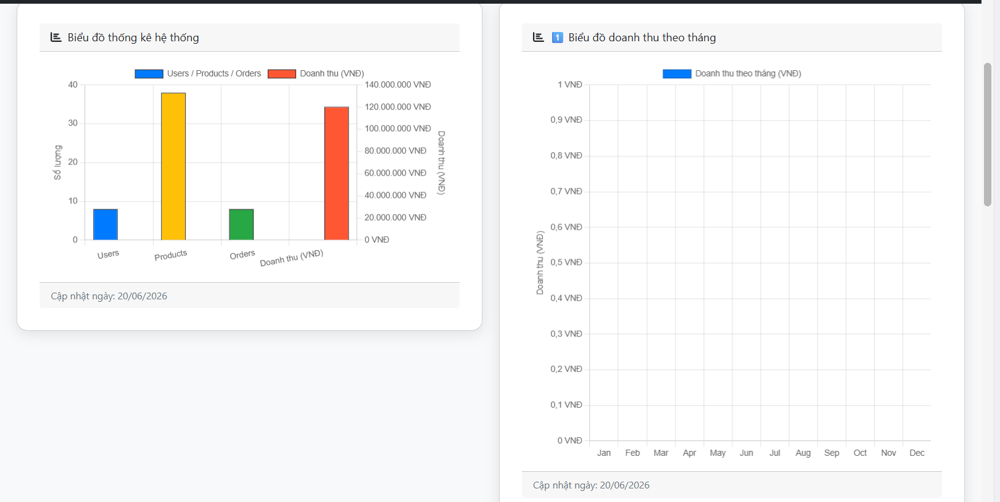
</p>

---

#  Database Design (ERD)

The application uses a relational database designed to support a complete e-commerce workflow.

Main entities include:

- User
- Role
- Product
- Category
- Cart
- CartDetail
- Order
- OrderDetail
- PaymentTransaction
- ChatConversation
- ChatMessage

---

<!-- ========================================================= -->
<!-- TODO                                                      -->
<!-- Export your ERD from MySQL Workbench or draw.io           -->
<!--                                                           -->
<!-- File: docs/database-erd.png                               -->
<!-- ========================================================= -->

<p align="center">
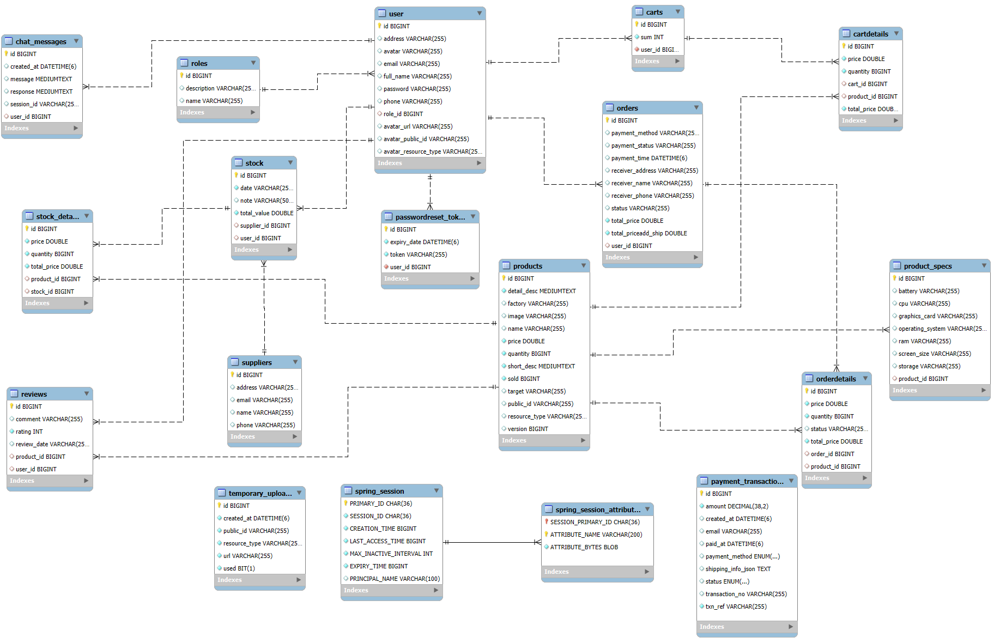
</p>

---

#  AI Chatbot (RAG Architecture)

One of the most important features of this project is the intelligent shopping assistant powered by **Retrieval-Augmented Generation (RAG)**.

Instead of asking the LLM to answer directly, the system first retrieves relevant products from Elasticsearch and then injects them into the prompt sent to Gemini.

---

## AI Request Flow

<!-- ========================================================= -->
<!-- TODO                                                      -->
<!-- Draw this architecture using draw.io                      -->
<!--                                                           -->
<!-- File: docs/rag-flow.png                                   -->
<!-- ========================================================= -->

<p align="center">
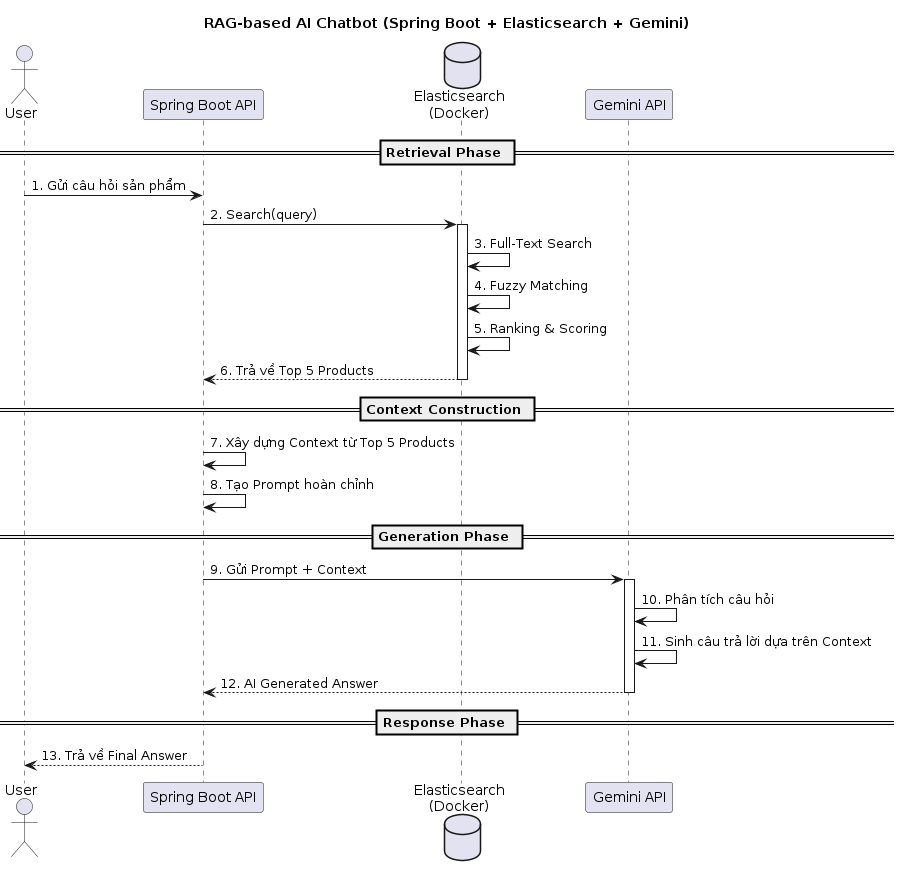
</p>

---

### Request Pipeline

```text
User Question
        │
        ▼
Spring Boot Controller
        │
        ▼
Search Service
        │
        ▼
Elasticsearch
        │
Retrieve Top 5 Products
        │
        ▼
Prompt Builder
        │
        ▼
Gemini API
        │
        ▼
Generated Answer
        │
        ▼
Browser
```

---

### AI Features

- Retrieval-Augmented Generation (RAG)
- Full-text Search
- Product Ranking
- Conversation Context
- Last 5 Messages Memory
- Fuzzy Search
- Intelligent Product Recommendation

---

#  Payment Processing Workflow

The payment module has been redesigned to ensure transaction integrity and prevent duplicate processing.

Supported gateways:

- VNPay
- MoMo

---

## Payment Sequence Diagram

<p align="center">
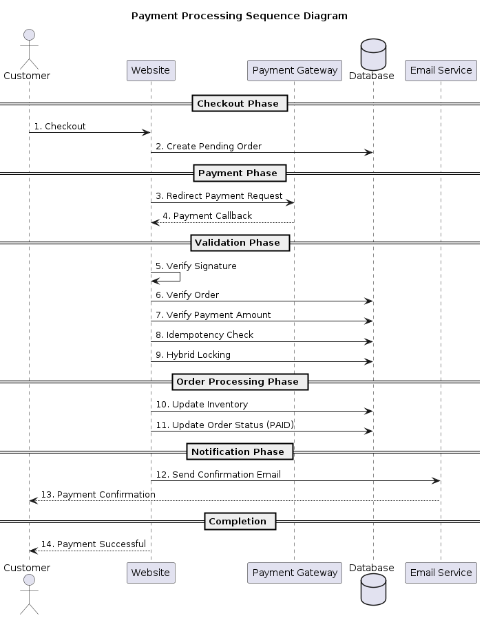
</p>

### Payment Security

The payment workflow includes multiple validation layers:

- Signature Verification
- Order Validation
- Amount Verification
- Idempotency Protection
- Hybrid Locking
- Automatic Inventory Update

---

#  Docker Architecture

The project supports containerized deployment using Docker Compose.

The deployment consists of three main services:

- Spring Boot Application
- MySQL Database
- Elasticsearch

---

<!-- ========================================================= -->
<!-- TODO                                                      -->
<!-- Create Docker deployment architecture                     -->
<!--                                                           -->
<!-- File: docs/docker-architecture.png                        -->
<!-- ========================================================= -->

<p align="center">
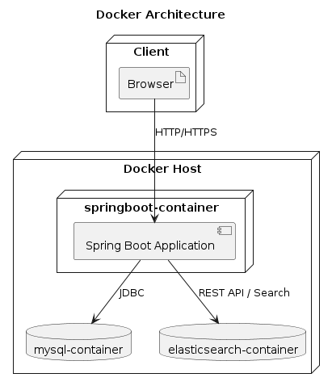
</p>

---

Example deployment:

```text
Browser
      │
      ▼
Spring Boot Container
      │
 ├─────────────┐
 ▼             ▼
MySQL     Elasticsearch
```

---

#  CI/CD Workflow

Continuous Integration and Continuous Deployment are implemented using **GitHub Actions**.

The pipeline automatically:

- Build the project
- Run unit tests
- Build Docker image
- Push image to Docker Hub
- Deploy to Ubuntu VPS
- Restart Docker Compose services

---

### CI Workflow (Activity Diagram)
<p align="center">
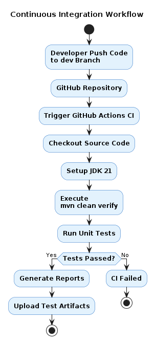
</p>

---
### CD Workflow (Activity Diagram)

<p align="center">
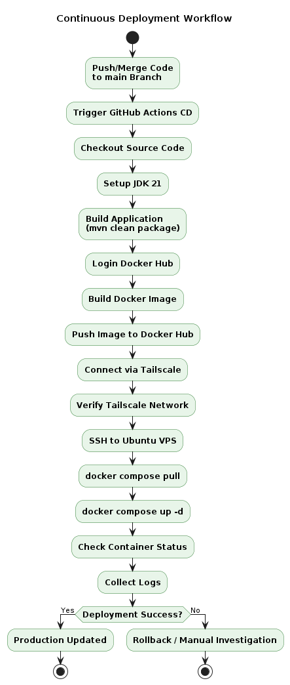
</p>


---

## Deployment Pipeline
<p align="center">
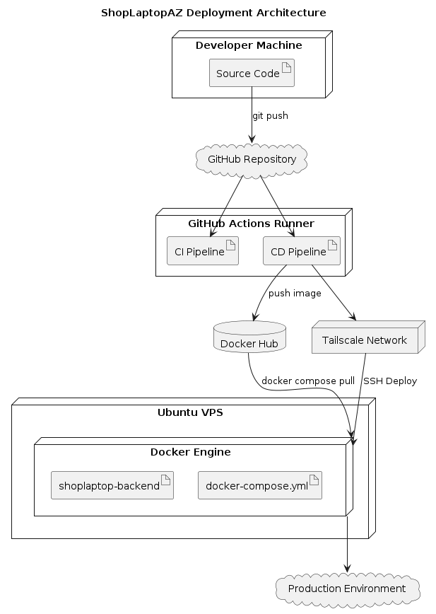
</p>


```text
Developer

      │

git push

      │

      ▼

GitHub

      │

      ▼

GitHub Actions

      │

      ├──────── Maven Build

      ├──────── Unit Tests

      ├──────── Docker Build

      ├──────── Push Docker Hub

      │

      ▼

Ubuntu VPS (SSH + Tailscale)

      │

docker compose pull

      │

docker compose up -d

      │

      ▼

Production
```

---

### CI/CD Highlights

- Automated Maven Build
- Automated Unit Testing
- Docker Image Build
- Docker Hub Publishing
- Secure VPS Deployment via SSH
- Tailscale Remote Access
- Zero Manual Deployment
---
# Installation

## Prerequisites

Before running this project, ensure the following software is installed on your machine.

| Software | Recommended Version |
|-----------|---------------------|
| Java | JDK 21 |
| Maven | 3.9+ |
| MySQL | 8.0+ |
| Docker | Latest |
| Docker Compose | Latest |
| Git | Latest |

---

## Clone Repository

```bash
git clone https://github.com/Minhhieungo2kxx/WebThuongMaidienduLaptopAz.git

cd WebThuongMaidienduLaptopAz
```

---

## Import Database

Create a new MySQL database.

```sql
CREATE DATABASE laptopshop CHARACTER SET utf8mb4 COLLATE utf8mb4_unicode_ci;
```

Import the file SQL file.

```
shoplaptop.sql
```

You can import it using:

- MySQL Workbench
- phpMyAdmin
- IntelliJ Database Tool
- Command Line

Example:

```bash
mysql -u root -p laptopshop < laptopshop.sql
```

---

## Open Project

Open the project using your preferred IDE.

Recommended:

- IntelliJ IDEA Ultimate / Community
- Spring Tools Suite (STS)
- Eclipse

Allow Maven to download all dependencies.

---

## Build Project

```bash
mvn clean install
```

Expected output:

```text
BUILD SUCCESS
```

---

# Environment Variables

To protect sensitive information, the application uses environment variables instead of hardcoding credentials.

Create a `.env` file in the project root.

Example:

```env
#################################
# DATABASE
#################################

DB_URL=jdbc:mysql://localhost:3306/laptopshop

DB_USERNAME=root

DB_PASSWORD=your_password

#################################
# GOOGLE LOGIN
#################################

GOOGLE_CLIENT_ID=

GOOGLE_CLIENT_SECRET=

#################################
# GMAIL
#################################

MAIL_USERNAME=

MAIL_PASSWORD=

#################################
# GEMINI
#################################

GEMINI_API_KEY=

#################################
# CLOUDINARY
#################################

CLOUDINARY_CLOUD_NAME=

CLOUDINARY_API_KEY=

CLOUDINARY_API_SECRET=

#################################
# VNPAY
#################################

VNPAY_TMN_CODE=

VNPAY_HASH_SECRET=

#################################
# MOMO
#################################

MOMO_ACCESS_KEY=

MOMO_SECRET_KEY=

MOMO_PARTNER_CODE=

#################################
# ELASTICSEARCH
#################################

ELASTICSEARCH_HOST=http://localhost:9200
```

---

## Spring Boot Configuration

<!-- ========================================================= -->
<!-- TODO                                                      -->
<!-- Replace this with your actual application.properties      -->
<!-- or application.yml configuration if necessary             -->
<!-- ========================================================= -->

The project automatically loads these values during application startup.

Sensitive information is excluded from version control using:

```
.gitignore
```

---

#  Docker Deployment

The project supports containerized deployment using Docker Compose.

Current services:

- Spring Boot Application
- MySQL Database
- Elasticsearch

---

## Docker Structure

```text
docker-compose.yml

Dockerfile

.dockerignore

.env
```

---

## Build Docker Images

```bash
docker compose build
```

---

## Start Containers

```bash
docker compose up -d
```

---

## Stop Containers

```bash
docker compose down
```

---

## View Logs

```bash
docker compose logs -f
```

---

## Check Running Containers

```bash
docker ps
```

---

## Docker Volumes

Persistent storage is configured using Docker Volumes.

This prevents data loss after restarting containers.

---

<!-- ========================================================= -->
<!-- TODO                                                      -->
<!-- Add screenshot of Docker Desktop or docker ps             -->
<!--                                                           -->
<!-- File: docs/docker-running.png                             -->
<!-- ========================================================= -->

<p align="center">
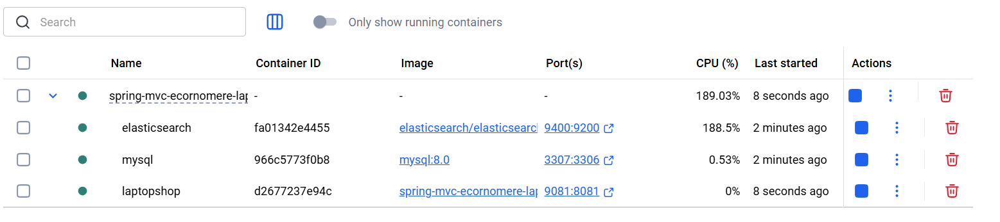
</p>

---

# ▶ Running the Project

There are two supported ways to run the application.

---

## Option 1 — IntelliJ IDEA

1. Open the project.
2. Wait for Maven indexing.
3. Configure Environment Variables.
4. Run the Spring Boot main class.

Example:

```
LaptopShopApplication.java
```

---

## Option 2 — Maven

```bash
mvn spring-boot:run
```

---

## Application URLs

<!-- ========================================================= -->
<!-- TODO                                                      -->
<!-- Update the URLs if your project uses another port         -->
<!-- ========================================================= -->

| Service | URL                   |
|----------|-----------------------|
| Web Application | http://localhost:8081 |
| Elasticsearch | http://localhost:9200 |

---

## Default Administrator Account

> ** IMPORTANT**
>
> Replace this section with your own seeded administrator account if available.

Example:

```text
Email:
admin@gmail.com

Password:
123456
```

If no default account exists, remove this section.

---

## Verify Installation

The application has started successfully when:

- Spring Boot starts without errors.
- Database connection is established.
- Elasticsearch is connected.
- Home page is accessible.

Console example:

```text
Started LaptopShopApplication in XX.XXX seconds
```

---

#  Testing

The project includes a comprehensive unit testing suite to improve software reliability and maintainability.

---

## Testing Framework

- JUnit 5
- Mockito

Testing methodology:

- Arrange
- Act
- Assert (AAA)

---

## Test Coverage

Current project status:

-  140 Unit Tests
-  Business Logic Testing
-  Service Layer Testing
-  Validation Testing
-  Payment Processing Testing
-  Exception Handling Testing

---

## Run All Tests

```bash
mvn test
```

---

## Generate Test Report

```bash
mvn surefire-report:report
```

---

<!-- ========================================================= -->
<!-- TODO                                                      -->
<!-- Screenshot IntelliJ test result                           -->
<!--                                                           -->
<!-- File: docs/testing-report.png                             -->
<!-- ========================================================= -->

<p align="center">
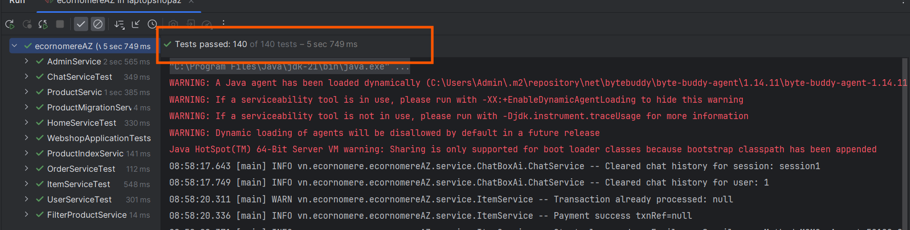
</p>

---

## Testing Principles

The project follows the **Given – When – Then** testing pattern.

Example:

```
Given

↓

Prepare Test Data

↓

When

↓

Execute Business Logic

↓

Then

↓

Verify Expected Result
```

---

## Test Directory

```text
src

└── test

    ├── controller

    ├── service

    ├── repository

    └── util
```

---

## Quality Goals

The testing suite aims to ensure:

- Business logic correctness
- Stable payment workflow
- Reliable validation
- Exception handling consistency
- Easier future maintenance

---
#  Academic Documentation

> **Project Background**
>
> LaptopShopAZ was originally developed as part of a university software engineering course.
>
> After completing the course, the project continued to evolve into a production-oriented portfolio project by integrating modern technologies such as Docker, CI/CD, AI-powered product recommendations, Elasticsearch, and enterprise-level concurrency control.

---

#  Project Report

<!-- ========================================================= -->
<!-- TODO                                                      -->
<!-- Put your final university report here                     -->
<!--                                                           -->
<!-- File: docs/LaptopShopAZ_Report.pdf                        -->
<!-- ========================================================= -->

The complete project documentation includes:

- Requirement Analysis
- Business Process Analysis
- Functional Specifications
- Use Case Diagram
- Database Design
- System Architecture
- Sequence Diagrams
- Implementation Details
- Testing Strategy
- Project Evaluation

## Project Report

```
docs/LaptopShopAZ_Report.pdf
```

---

##  Academic Achievement

| Item | Result                                  |
|------|-----------------------------------------|
| Course Type | University Software Engineering Project |
| Final Score | **8.8 / 10**                            |
| Status | Successfully Completed                  |

> **Note**
>
> The current GitHub version has been significantly extended beyond the original academic submission by incorporating additional enterprise-level features, modern DevOps practices, AI integration, and software engineering improvements.

---

#  Project Evolution

The project has been continuously improved through multiple development phases.

---

## Phase 1 — Foundation

- User Management

- Spring MVC Architecture

- JSP Frontend

- CRUD Operations

- Product Management

- Category Filtering

---

## Phase 2 — Authentication

- Spring Security

- Session Authentication

- Google OAuth Login

- Forgot Password

- Email Verification

---

## Phase 3 — Shopping Experience

- Shopping Cart

- Checkout

- Purchase History

- Product Search

- Multi-condition Filtering

---

## Phase 4 — Online Payment

- VNPay Integration

- MoMo Integration

- Payment Validation

- Email Confirmation

---

## Phase 5 — Administration

- Dashboard

- Revenue Statistics

- Order Statistics

- Top-selling Products

---

## Phase 6 — Artificial Intelligence

- Gemini API

- Chat History

- Context Memory

- Elasticsearch

- Retrieval-Augmented Generation (RAG)

---

## Phase 7 — Enterprise Improvements

- Global Exception Handling

- Hybrid Locking

- Cloudinary

- Environment Variables

- File Validation

---

## Phase 8 — DevOps

- Docker

- Docker Compose

- GitHub Actions

- Docker Hub

- Ubuntu VPS Deployment

- Tailscale

---

## Phase 9 — Quality Assurance

- JUnit 5

- Mockito

- 140 Unit Tests

---

#  Development Timeline

The following timeline summarizes the project's major milestones.

| Phase | Major Features |
|--------|----------------|
| Foundation | CRUD, MVC, Product Management |
| Authentication | Spring Security, Google Login |
| Shopping | Cart, Checkout, Purchase History |
| Payment | VNPay, MoMo |
| Dashboard | Statistics & Analytics |
| AI | Gemini + Elasticsearch (RAG) |
| Enterprise | Hybrid Locking, Exception Handling |
| DevOps | Docker, GitHub Actions, VPS Deployment |
| Testing | 140 Unit Tests |

---

#  Roadmap

The following roadmap shows completed features and future plans.

##  Completed

- [x] User Authentication
- [x] Role-based Authorization
- [x] Product CRUD
- [x] Category Management
- [x] Product Search
- [x] Product Filtering
- [x] Shopping Cart
- [x] Checkout
- [x] Purchase History
- [x] VNPay Payment
- [x] MoMo Payment
- [x] Email Notification
- [x] Google OAuth Login
- [x] AI Chatbot
- [x] RAG Architecture
- [x] Elasticsearch
- [x] Cloudinary
- [x] Docker
- [x] Docker Compose
- [x] GitHub Actions
- [x] Ubuntu VPS Deployment
- [x] Hybrid Locking
- [x] Global Exception Handling
- [x] Environment Variables
- [x] 140 Unit Tests

---

##  Planned Features

The project will continue to evolve with additional enterprise features.

- [ ] Redis Cache
- [ ] JWT Authentication
- [ ] Refresh Token
- [ ] Spring WebFlux
- [ ] Kafka Event Streaming
- [ ] Microservices Architecture
- [ ] Recommendation Engine
- [ ] Elasticsearch Vector Search
- [ ] OpenTelemetry Monitoring
- [ ] Prometheus & Grafana
- [ ] Kubernetes Deployment
- [ ] Helm Charts
- [ ] GitOps Deployment
- [ ] Multi-language Support
- [ ] Admin Analytics Dashboard
- [ ] Product Recommendation based on User Behavior

---

#  Future Improvements

Several enhancements are planned to further improve the scalability and maintainability of the platform.

## Backend

- Introduce Redis for caching frequently accessed data.
- Implement JWT-based authentication for REST APIs.
- Adopt Event-Driven Architecture using Apache Kafka.
- Split the application into Microservices.
- Add API Rate Limiting.

---

## AI

- Improve semantic search using Vector Embeddings.
- Integrate Retrieval-Augmented Generation with embedding models.
- Add personalized product recommendations.
- Enable multilingual AI conversations.

---

## DevOps

- Kubernetes deployment.
- Helm support.
- GitOps with ArgoCD.
- Blue-Green Deployment.
- Monitoring using Prometheus and Grafana.

---

## Testing

- Integration Testing
- End-to-End Testing
- Performance Testing
- Load Testing
- Security Testing

---

#  Highlights

This project demonstrates practical experience with modern Java backend development and enterprise software engineering concepts, including:

- Spring Boot MVC
- Spring Security
- Hibernate / JPA
- MySQL
- Docker
- CI/CD
- Elasticsearch
- Google Gemini API
- Retrieval-Augmented Generation (RAG)
- Hybrid Locking
- Cloudinary
- Global Exception Handling
- OAuth2 Login
- Online Payment Integration
- Unit Testing with JUnit 5 and Mockito

It serves as both an academic project and a continuously evolving portfolio application that reflects real-world software development practices.

---
---

#  Contributing

Contributions are always welcome!

If you would like to improve this project, you can:

- Fork this repository
- Create a new feature branch
- Commit your changes
- Submit a Pull Request

Please ensure that:

- The project builds successfully.
- Existing tests continue to pass.
- New features include appropriate tests whenever possible.
- Code follows the existing project structure and coding conventions.

---

#  Release History

The project has been continuously enhanced through multiple development iterations.

| Version | Highlights |
|----------|------------|
| **v1.0** | Initial Spring Boot MVC project, User CRUD, Product CRUD |
| **v1.1** | Product filtering, validation, ModelMapper integration |
| **v1.2** | Spring Security, Session Authentication |
| **v1.3** | Forgot Password, Email Service |
| **v1.4** | Google OAuth2 Login |
| **v2.0** | Shopping Cart & Checkout |
| **v2.1** | Purchase History |
| **v2.2** | Product Search & Pagination |
| **v2.3** | VNPay Integration |
| **v2.4** | Inventory Management |
| **v2.5** | Email Order Confirmation |
| **v3.0** | Revenue Dashboard & Sales Statistics |
| **v3.1** | MoMo Payment Integration |
| **v3.2** | AI Chatbot using Gemini API |
| **v3.3** | Context Memory Optimization |
| **v3.4** | RAG with Elasticsearch |
| **v3.5** | Hybrid Locking & Global Exception Handling |
| **v3.6** | Cloudinary Integration |
| **v3.7** | Docker & Docker Compose |
| **v3.8** | CI/CD with GitHub Actions |
| **v4.0** | 140 Unit Tests using JUnit 5 & Mockito |

---

#  Repository Structure

```text
LaptopShopAZ
│
├── .github/
│   └── workflows/
│
├── docker/
│
├── docs/
│   ├── banner.png
│   ├── demo.gif
│   ├── architecture.png
│   ├── database-erd.png
│   ├── rag-flow.png
│   ├── docker-architecture.png
│   ├── cicd-workflow.png
│   ├── LaptopShopAZ_Report.pdf
│   └── screenshots/
│
├── src/
│
├── Dockerfile
├── docker-compose.yml
├── .env.example
├── pom.xml
└── README.md
```

---

#  Acknowledgements

This project would not have been possible without the following technologies and services:

- Spring Boot
- Spring Security
- Spring Data JPA
- Hibernate
- MySQL
- Elasticsearch
- Google Gemini API
- Cloudinary
- VNPay
- MoMo
- Docker
- GitHub Actions
- Bootstrap
- JUnit 5
- Mockito

Special thanks to the open-source community for providing excellent libraries and documentation.

---

#  Contact

If you have any questions, suggestions, or would like to collaborate, feel free to contact me.

**Author**

**Minh Hieu Ngo Software Engineer  **

GitHub

https://github.com/Minhhieungo2kxx

<!-- ========================================================= -->
<!-- TODO                                                      -->
<!-- Add your LinkedIn profile                                -->
<!-- ========================================================= -->

Facebook

https://www.facebook.com/tienti.tieu.1

<!-- ========================================================= -->
<!-- TODO                                                      -->
<!-- Add your Email                                            -->
<!-- ========================================================= -->

Email

ngominhhieu8d@gmail.com

---

#  Support

If you found this project helpful, please consider giving it a ⭐ on GitHub.

Your support helps motivate future improvements and encourages continued open-source development.

---

#  License

This project is released under the **MIT License**.

You are free to:

- Use
- Modify
- Study
- Share

for educational and personal purposes.

See the **LICENSE** file for more details.

---

<p align="center">

Made with ❤️ using Spring Boot, Java, Docker, Elasticsearch and Gemini AI.

</p>

<p align="center">

⭐ Thank you for visiting this repository! ⭐

</p>